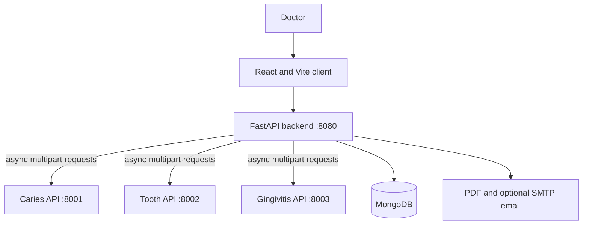

# DentalX Camp

DentalX Camp is a doctor-facing AI-assisted screening prototype. A doctor registers a patient, submits one intraoral photo, reviews the output from three independent model APIs, records an assessment and notes, and can download or e-mail a PDF report.

> **AI screening aid only — not a diagnosis. Final assessment must be performed by a qualified dental professional.**

## Architecture



The main backend runs concurrent requests with `asyncio` and `httpx`. A failed or malformed model response is isolated and returned as **Unavailable**. A missing result is never converted into a negative finding. The original uploaded image is processed in memory and discarded; the annotated image is retained with the screening to support review and report generation.

## Existing models

- **Caries:** `occlusal_caries_det.pt` is the YOLO detector. `occlusal_severity.pt` and `occlusal_severity_mobilenet_v3.pt` are identical files (matching SHA-256); both contain the selected MobileNet-V3 classifier with `no_caries`, `mild`, `moderate`, and `advanced` classes. `occlusal_severity_efficientnet_b0.pt` is retained and not selected by the app. `occlusal_det.pt` is the older four-class YOLO severity detector and is not substituted for the detector-plus-classifier pipeline.
- **Tooth type:** `model2_tooth_type/models/best.pt` is a four-class YOLO detector (`incisor`, `canine`, `premolar`, `molar`). The app shows type and confidence only. It does not infer FDI tooth numbers.
- **Gingivitis:** `model3_gingival/models/best.pt` is a single-class YOLO detector (`gingivitis`).

All original weights remain in their model folders. The app does not retrain or replace them. Evaluation metrics remain in the research files and are not presented as clinical guarantees in the app.

## What is implemented

- Doctor registration and login; passwords are PBKDF2-hashed, and signed sessions expire after 12 hours.
- Doctor-scoped patient registry, search, automatic IDs (`DX-YYYY-00001`), and screening history.
- One-image screening with preview, mobile camera capture, drag-and-drop, format/resolution validation, and client-side compression.
- Independent model status, structured regions, colored server-side OpenCV annotations, transparent risk rules, and an `INCOMPLETE` risk state when models are unavailable.
- Doctor assessment and clinical notes. A report can be generated or sent only after the doctor saves an assessment.
- A compact PDF report, optional SMTP email, doctor-scoped dashboard and CSV export.
- System-health view for the database, all three model APIs, and email configuration.

Risk rules: **HIGH** for Moderate/Advanced caries or gingivitis confidence above 0.60; **MODERATE** for Mild caries or any detected gingivitis; **LOW** when all three checks are available and none of those rules apply. If no positive finding is available but one or more checks are unavailable, the result is **INCOMPLETE**.

## Local setup

Requirements: Windows, Python 3.12, Node.js 20+, and a MongoDB instance/Atlas URI.

Create the shared Python environment used by the three model services and main backend:

```powershell
cd model1_occlusal\code
python -m venv .venv
.venv\Scripts\Activate.ps1
pip install -r requirements.txt
pip install -r ..\..\camp_web\backend\requirements.txt
```

Copy `camp_web/.env.example` to `camp_web/server/.env`. Set `MONGODB_URI` and a random `JWT_SECRET` of at least 32 characters. Never commit `.env` files. Email is optional.

Start the full application from the repository root:

```bat
run_app.bat
```

This builds the React client, starts the caries, tooth, and gingivitis APIs on ports 8001–8003, starts the FastAPI backend on port 8080, and opens the app. Keep the service windows open. The backend also serves the built frontend. For UI development, run `npm run dev:client` from `camp_web`; Vite proxies `/api` to port 8080.

## Environment variables

| Variable | Purpose |
|---|---|
| `APP_ENV` | `development` or `production`; production requires explicit hosted model URLs. |
| `MONGODB_URI` | MongoDB connection string. |
| `DATABASE_NAME` | Database name; defaults to `dentalx_camp`. |
| `JWT_SECRET` | Random signing secret, at least 32 characters. |
| `CARIES_API_URL` | Caries service `/analyze` URL. |
| `TOOTH_API_URL` | Tooth service `/analyze` URL. |
| `GINGIVITIS_API_URL` | Gingivitis service `/analyze` URL. |
| `MODEL_API_KEY` | Optional bearer token shared with model APIs; per-service keys can override it. |
| `MODEL_TIMEOUT_SECONDS` | Model request timeout; defaults to 90 seconds. |
| `EMAIL_HOST`, `EMAIL_PORT`, `EMAIL_USERNAME`, `EMAIL_PASSWORD`, `EMAIL_FROM` | Optional SMTP configuration. Legacy `SMTP_*` keys are also accepted. |
| `CAMP_NAME` | PDF report heading. |
| `FRONTEND_ORIGINS` | Comma-separated allowed origins when frontend and backend use separate hosts. |

The browser never receives database, model, JWT-signing, or SMTP secrets. Production model URLs must be set explicitly; localhost fallbacks apply only in development.

## API

Main backend:

- `GET /api/health`
- `POST /api/auth/register`, `POST /api/auth/login`, `GET /api/auth/me`, `POST /api/auth/logout`
- `GET /api/patients`, `POST /api/patients`, `GET /api/patients/{patient_id}/screenings`
- `POST /api/screen`
- `GET /api/screenings/{screening_id}`, `PATCH /api/screenings/{screening_id}/review`
- `GET /api/screenings/{screening_id}/report.pdf`, `POST /api/screenings/{screening_id}/email`
- `GET /api/queue`, `GET /api/stats`, `GET /api/export.csv`

Each model service separately exposes `GET /health` and `POST /analyze`.

## Tests

Run the backend suite with the shared environment:

```powershell
cd camp_web
..\model1_occlusal\code\.venv\Scripts\python.exe -m pytest backend\tests -q
```

The suite covers risk fusion, malformed/unavailable downstream responses, password hashing, health, invalid/oversized uploads, and partial model failure. The local verification also exercises all three real APIs using the repository's sample images.

## Hosting

`prepare_vercel_deploy.py` creates a self-contained model-service bundle with the model weights. Vercel Services must be enabled for the project, and production environment variables must be configured before deployment. Model deployments use CPU-only PyTorch and NumPy 1.x pins compatible with the shared inference code. Set `APP_ENV=production`, hosted model URLs, `MONGODB_URI`, `JWT_SECRET`, and optional email credentials in the host environment. See the repository's `VERCEL_DEPLOY.md` for current deployment constraints.

## Limitations

- This is a research prototype, not a diagnostic or treatment recommendation system.
- It supports the three current models and their reported output only. It does not infer tooth identity/numbering beyond the four tooth types.
- Email remains disabled unless SMTP settings are supplied.
- The current sample-based local integration is not clinical validation or a performance guarantee.
