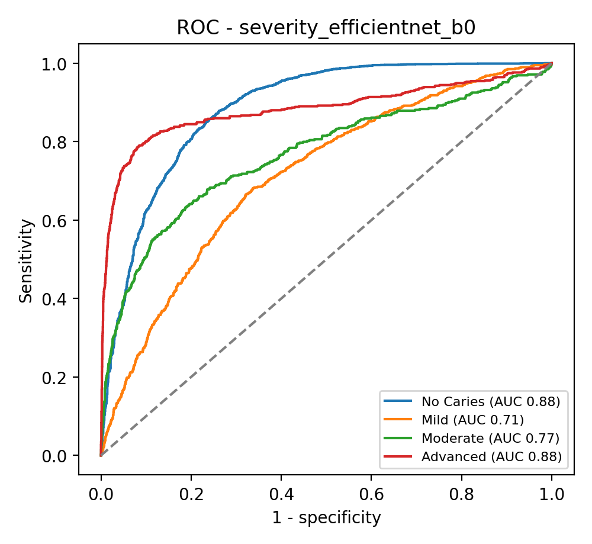
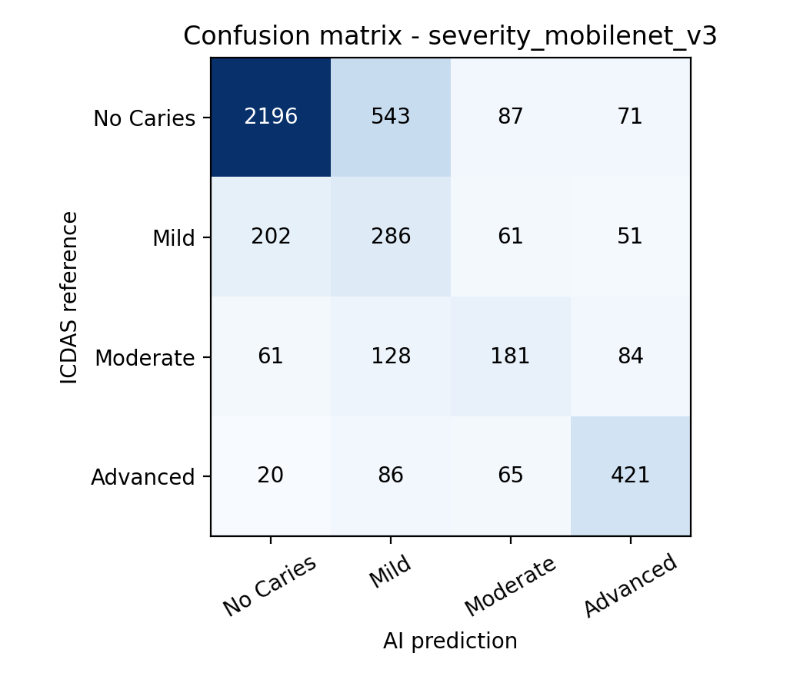
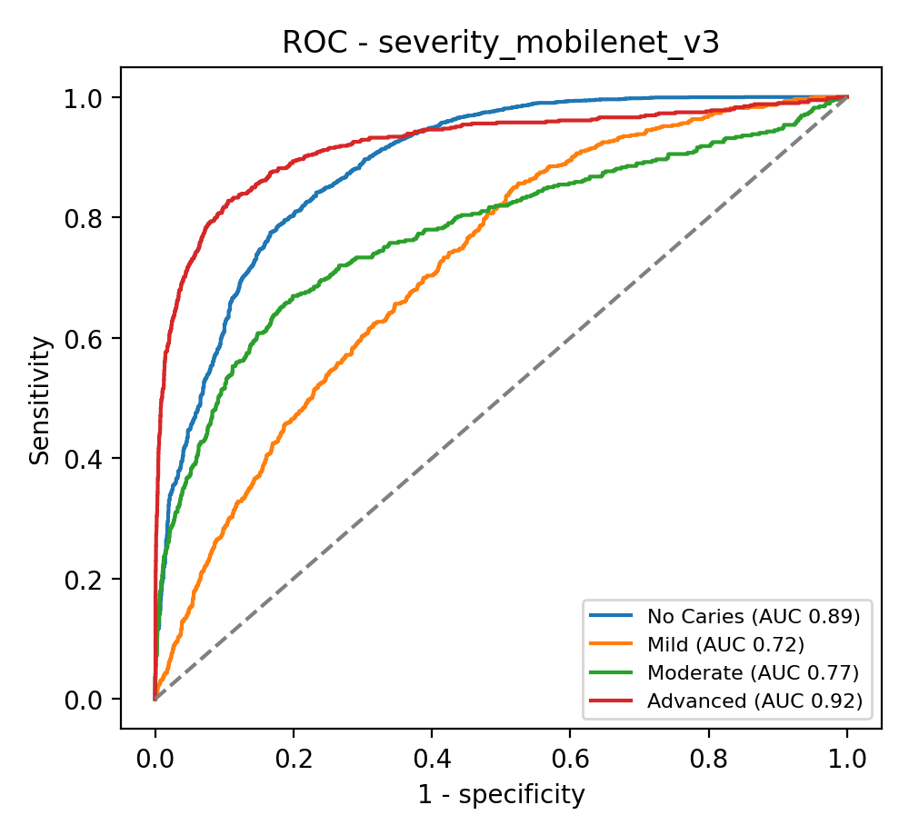

# Occlusal caries AI - diagnostic performance (out-of-fold, patient-grouped CV)

## Caries severity - efficientnet_b0  (selected for app)

Teeth 4543, patients 376. Accuracy **69.7%** (67.4%-71.6%), Cohen's kappa **0.475** (0.448-0.500), linear-weighted kappa **0.623** (0.597-0.647), macro-F1 0.577

| Class | Sensitivity (95% CI) | Specificity (95% CI) | PPV | NPV | Accuracy | F1 | AUC (95% CI) |
|---|---|---|---|---|---|---|---|
| No Caries | 80.2% (77.9%-82.4%) | 80.3% (77.4%-83.2%) | 87.8% | 69.8% | 80.3% | 0.838 | 0.884 (0.868-0.899) |
| Mild | 43.2% (38.0%-48.5%) | 83.7% (81.8%-85.3%) | 28.7% | 90.6% | 78.3% | 0.345 | 0.714 (0.686-0.742) |
| Moderate | 44.1% (37.8%-50.1%) | 93.0% (92.0%-93.9%) | 41.2% | 93.7% | 88.1% | 0.426 | 0.766 (0.718-0.807) |
| Advanced | 64.9% (60.1%-69.1%) | 96.9% (96.1%-97.6%) | 75.7% | 94.8% | 92.7% | 0.699 | 0.882 (0.858-0.904) |

Screening view (any caries vs sound): sensitivity 80.3%, specificity 80.2%, PPV 69.8%, NPV 87.8%, AUC 0.884

 

## Caries severity - mobilenet_v3

Teeth 4543, patients 376. Accuracy **67.9%** (65.6%-70.1%), Cohen's kappa **0.460** (0.428-0.489), linear-weighted kappa **0.604** (0.575-0.630), macro-F1 0.571

| Class | Sensitivity (95% CI) | Specificity (95% CI) | PPV | NPV | Accuracy | F1 | AUC (95% CI) |
|---|---|---|---|---|---|---|---|
| No Caries | 75.8% (72.9%-78.2%) | 82.8% (79.8%-85.5%) | 88.6% | 66.0% | 78.3% | 0.817 | 0.887 (0.871-0.903) |
| Mild | 47.7% (42.1%-53.5%) | 80.8% (78.5%-82.8%) | 27.4% | 91.0% | 76.4% | 0.348 | 0.720 (0.690-0.747) |
| Moderate | 39.9% (34.3%-45.4%) | 94.8% (93.9%-95.6%) | 45.9% | 93.4% | 89.3% | 0.427 | 0.774 (0.734-0.813) |
| Advanced | 71.1% (66.5%-75.4%) | 94.8% (93.8%-95.6%) | 67.1% | 95.6% | 91.7% | 0.691 | 0.921 (0.903-0.938) |

Screening view (any caries vs sound): sensitivity 82.8%, specificity 75.8%, PPV 66.0%, NPV 88.6%, AUC 0.887

 

**severity: efficientnet_b0 vs mobilenet_v3** - McNemar exact p = 0.004 (only efficientnet_b0 correct: 455, only mobilenet_v3 correct: 372)

## Proforma evaluation table (AI vs ICDAS)

| Variable | ICDAS reference | Match (Yes) | Mismatch (No) |
|---|---|---|---|
| Tooth Type | Premolar / Molar | 0 | 0 |
| Caries Severity | No Caries | 2324 | 573 |
| Caries Severity | Mild | 259 | 341 |
| Caries Severity | Moderate | 200 | 254 |
| Caries Severity | Advanced | 384 | 208 |
