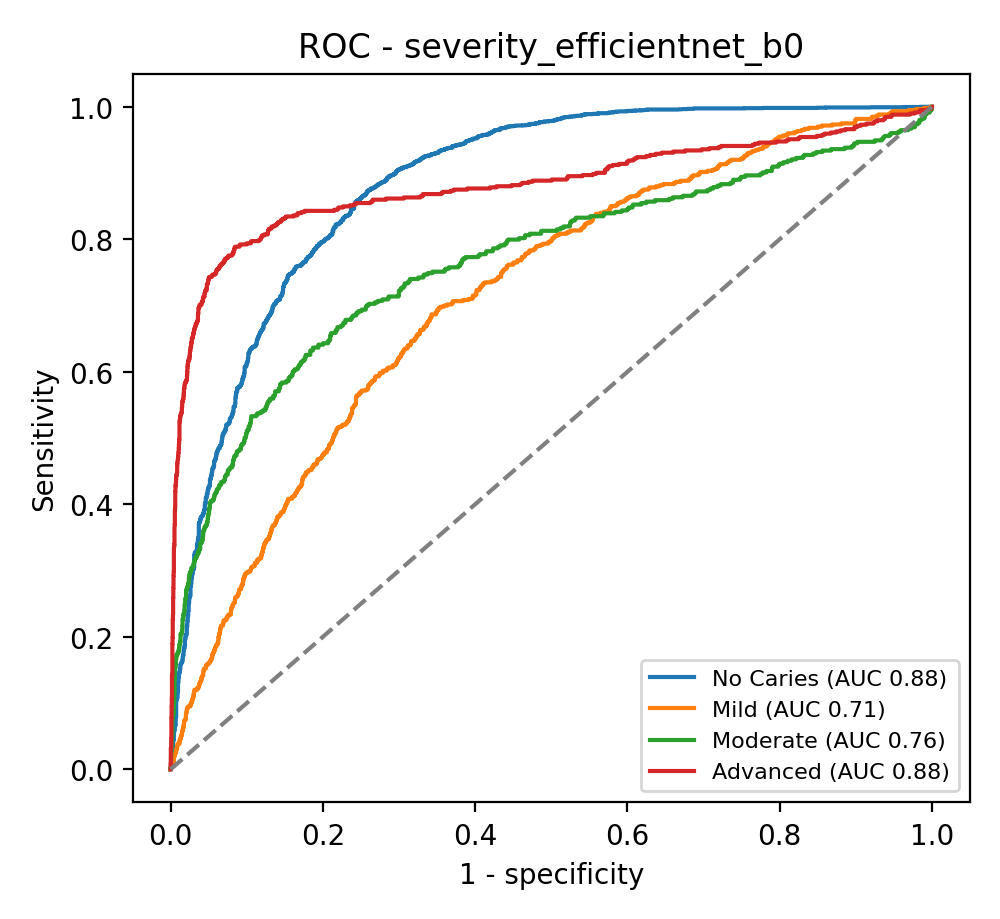
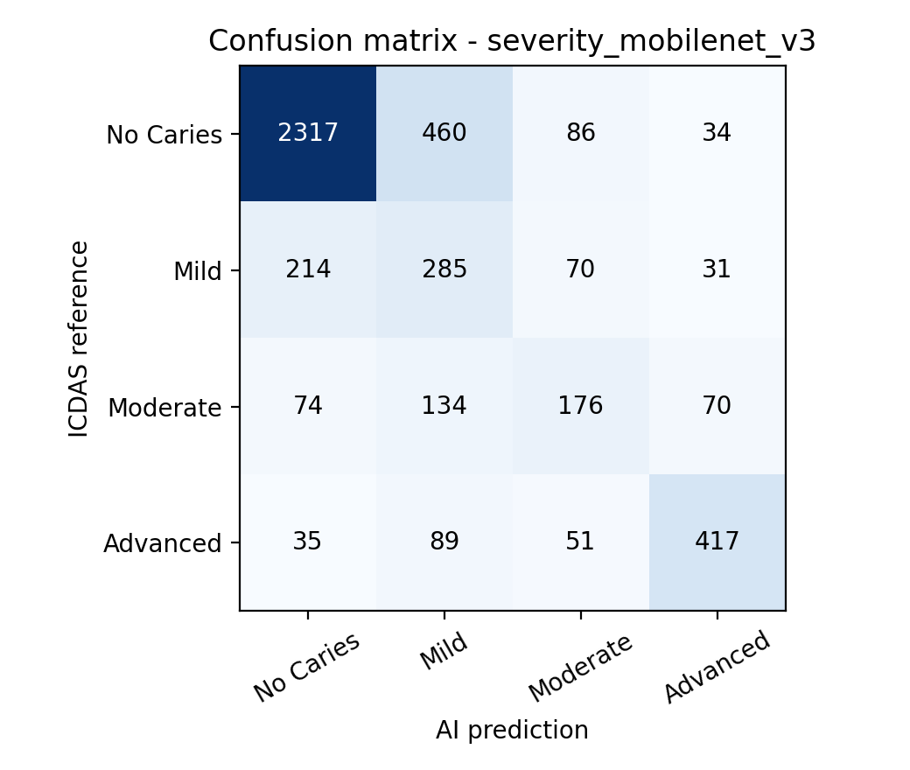
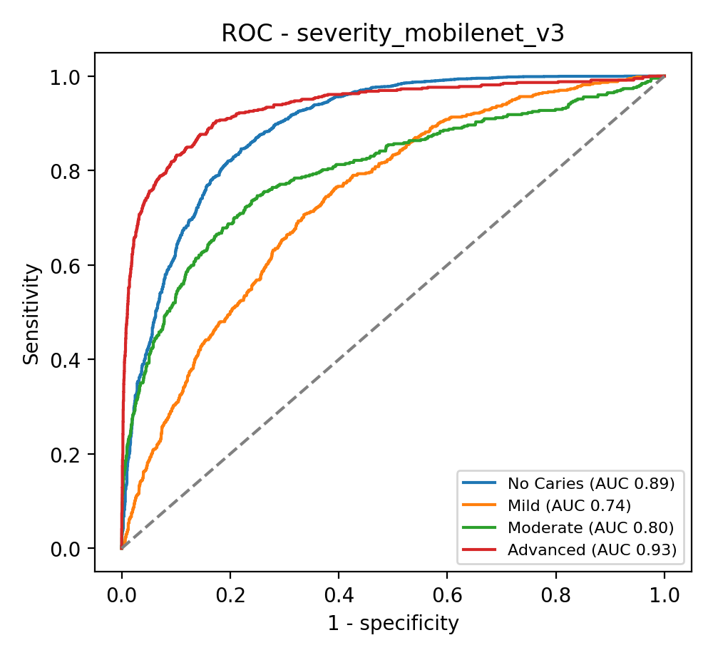

# Occlusal caries AI - diagnostic performance (out-of-fold, patient-grouped CV)

## Caries severity - efficientnet_b0

Teeth 4543, patients 376. Accuracy **68.9%** (66.7%-70.8%), Cohen's kappa **0.465** (0.437-0.490), linear-weighted kappa **0.615** (0.588-0.638), macro-F1 0.571

| Class | Sensitivity (95% CI) | Specificity (95% CI) | PPV | NPV | Accuracy | F1 | AUC (95% CI) |
|---|---|---|---|---|---|---|---|
| No Caries | 79.1% (76.8%-81.2%) | 80.2% (77.3%-83.0%) | 87.5% | 68.5% | 79.5% | 0.831 | 0.884 (0.868-0.899) |
| Mild | 42.3% (37.4%-47.8%) | 83.3% (81.4%-85.1%) | 27.8% | 90.5% | 77.9% | 0.336 | 0.714 (0.687-0.742) |
| Moderate | 43.6% (37.6%-49.3%) | 92.6% (91.5%-93.5%) | 39.5% | 93.7% | 87.7% | 0.415 | 0.765 (0.717-0.807) |
| Advanced | 65.5% (61.1%-69.8%) | 96.9% (96.1%-97.5%) | 75.8% | 94.9% | 92.8% | 0.703 | 0.882 (0.857-0.904) |

Screening view (any caries vs sound): sensitivity 80.2%, specificity 79.1%, PPV 68.5%, NPV 87.5%, AUC 0.884

 

## Caries severity - mobilenet_v3  (selected for app)

Teeth 4543, patients 376. Accuracy **70.3%** (68.1%-72.5%), Cohen's kappa **0.486** (0.454-0.515), linear-weighted kappa **0.626** (0.597-0.653), macro-F1 0.588

| Class | Sensitivity (95% CI) | Specificity (95% CI) | PPV | NPV | Accuracy | F1 | AUC (95% CI) |
|---|---|---|---|---|---|---|---|
| No Caries | 80.0% (77.6%-82.1%) | 80.4% (77.3%-83.2%) | 87.8% | 69.5% | 80.1% | 0.837 | 0.890 (0.873-0.907) |
| Mild | 47.5% (41.8%-52.8%) | 82.7% (80.7%-84.5%) | 29.4% | 91.2% | 78.0% | 0.364 | 0.740 (0.712-0.766) |
| Moderate | 38.8% (32.9%-44.5%) | 94.9% (94.1%-95.7%) | 46.0% | 93.3% | 89.3% | 0.421 | 0.798 (0.767-0.830) |
| Advanced | 70.4% (65.6%-75.0%) | 96.6% (95.8%-97.2%) | 75.5% | 95.6% | 93.2% | 0.729 | 0.934 (0.917-0.949) |

Screening view (any caries vs sound): sensitivity 80.4%, specificity 80.0%, PPV 69.5%, NPV 87.8%, AUC 0.890

 

**severity: efficientnet_b0 vs mobilenet_v3** - McNemar exact p = 0.032 (only efficientnet_b0 correct: 399, only mobilenet_v3 correct: 463)

## Proforma evaluation table (AI vs ICDAS)

| Variable | ICDAS reference | Match (Yes) | Mismatch (No) |
|---|---|---|---|
| Tooth Type | Premolar / Molar | 0 | 0 |
| Caries Severity | No Caries | 2317 | 580 |
| Caries Severity | Mild | 285 | 315 |
| Caries Severity | Moderate | 176 | 278 |
| Caries Severity | Advanced | 417 | 175 |
